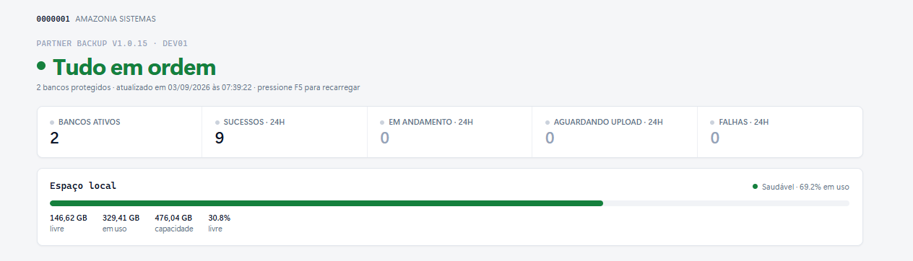
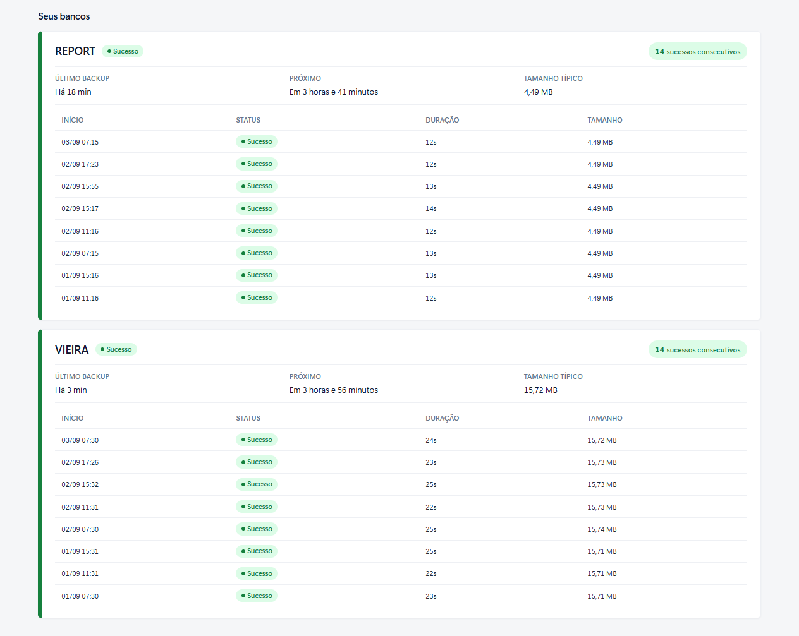

<div align="center">

# Partner Backup

**Backup automatizado dos bancos SQL Server dos clientes do Partner ERP, com envio seguro para a nuvem.**
Desenvolvido e mantido pela [**Amazônia Sistemas**](https://amazoniasistemas.com.br).

[](https://github.com/amazoniasistemas/PartnerBackup-releases/releases/latest)
[](https://github.com/amazoniasistemas/PartnerBackup-releases/releases/latest)
[](#requisitos)

### [⬇️ Baixar a última versão](https://github.com/amazoniasistemas/PartnerBackup-releases/releases/latest)

</div>

---

Este repositório é o **canal oficial de distribuição** do Partner Backup. Cada
versão publicada aqui traz o instalador (`.msi`) e o hash de verificação
(`.sha256`) — e é também de onde o próprio produto busca **atualizações
automaticamente**.

> [!IMPORTANT]
> O instalador exige uma **chave de ativação** fornecida pela Amazônia Sistemas.
> Sem ela, o produto não realiza backups. Baixar o `.msi` daqui não habilita o
> serviço por conta própria.

---

## Monitoramento em tempo real

Cada instalação abre um painel no navegador (`http://<servidor>:5002/`) com o
estado do backup à vista — sem precisar de usuário logado no servidor:



E o detalhe de cada banco protegido, com o histórico das últimas execuções:



---

## O que é

O Partner Backup roda como um **serviço do Windows** no servidor do cliente e,
de forma agendada e automática:

- 🗄️ Gera o backup dos bancos SQL Server **sem interferir** na rotina de backup do cliente (`COPY_ONLY`);
- 🗜️ Compacta com alta taxa de redução (7-Zip / LZMA2);
- ☁️ Envia para a nuvem corporativa de forma **resiliente** — sobrevive a quedas de internet e reinicializações, retomando uploads de onde pararam;
- 📊 Registra o histórico e o status de cada execução, visível no painel.

A gestão é toda pelo **navegador**:

- **Painel público** (somente leitura): `http://<servidor>:5002/`
- **Painel administrativo** (com login): botão **Configurar** no canto superior.

---

## Requisitos

- **Windows** (Server ou Desktop) **64-bit**;
- **SQL Server** (Express, Standard ou Enterprise) acessível pelo servidor;
- Privilégios de **administrador** para instalar;
- **Nenhum pré-requisito de runtime** — o instalador é *self-contained* (não é
  necessário instalar .NET nem qualquer outra dependência).

---

## Instalação

1. Acesse a [última versão](https://github.com/amazoniasistemas/PartnerBackup-releases/releases/latest);
2. Baixe o arquivo **`PartnerBackup-X.Y.Z.msi`**;
3. Execute o instalador e conclua o assistente;
4. Ative a instalação com a **chave fornecida pela Amazônia Sistemas**;
5. Acesse `http://localhost:5002/` no navegador do servidor para acompanhar.

---

## Verificação de integridade (SHA-256)

Cada release inclui um arquivo `PartnerBackup-X.Y.Z.sha256`. Para conferir que o
download não foi corrompido, no **PowerShell**:

```powershell
Get-FileHash .\PartnerBackup-1.0.8.msi -Algorithm SHA256
```

Compare o resultado com o conteúdo do `.sha256` correspondente — os valores devem
ser **idênticos**.

---

## Atualizações automáticas

Instalações ativas **verificam e aplicam atualizações sozinhas**: o produto
consulta periodicamente a última versão publicada aqui, baixa o instalador de
forma **retomável** (tolerante a internet instável) e o aplica em silêncio,
dentro de uma janela segura — nunca durante um backup ou upload em andamento.
Nenhuma ação manual é necessária no cliente.

---

## Suporte

Suporte técnico e chaves de ativação são fornecidos pela **Amazônia Sistemas**:

- 📞 **Telefone / WhatsApp:** [(66) 3500-1800](https://wa.me/556635001800)
- 🌐 **Site:** <https://amazoniasistemas.com.br>

---

## Sobre

Partner Backup é um produto **proprietário** da **Amazônia Sistemas**. Este
repositório hospeda apenas os **binários de distribuição**; o código-fonte é
privado. Os instaladores são disponibilizados exclusivamente para uso pelos
clientes licenciados do Partner ERP.

<sub>© Amazônia Sistemas. Todos os direitos reservados.</sub>
